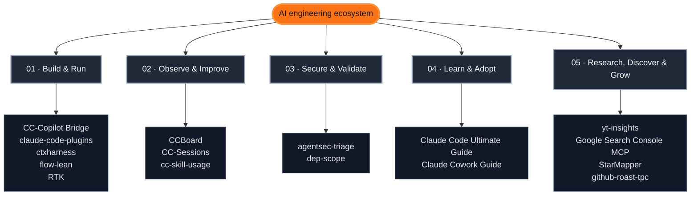

# Florian Bruniaux

**AI practitioner since 2017, context/harness engineering specialist.** 12 years in tech, ex-CTO/VP Engineering, chose to go back hands-on.
AI Founding Engineer @ [Méthode Aristote](https://methode-aristote.fr/) (EdTech + AI)

Direct, kind, energetic. Always 8 projects running.

---

## 📬 Blog & Guides

I write about AI-assisted engineering and keep my guides updated, most weeks bring something new.

- **[Claude Code Ultimate Guide](https://cc.bruniaux.com)**: the main reference, continuously updated (v3.43.0, 473 quiz questions across 17 categories, 13 whitepapers at 566 pages, 57 recap cards, 166-entry threat database)
- **[Blog](https://www.florian.bruniaux.com/blog/)**: articles on context engineering, AI-assisted workflows, and real production data (git stats, DORA metrics, honest retrospectives)

If you land here from a guide page or an article, starring the repo is the best way to see when something new ships.

---

## Current Focus

- AI Founding Engineer at [Méthode Aristote](https://methode-aristote.fr/) (TypeScript/Next.js, tRPC, Prisma, AI integration)
- Building and maintaining the Claude Code open-source ecosystem (guide + RTK + 9 other tools)
- Active member of [Dev with AI](https://devw.ai/), a French-speaking AI community of ~3,000 people today, aiming to become the reference AI community in France and, eventually, Europe
- Workshops on AI-assisted development for dev teams
- Occasional speaker at conferences, live streams, talks, BBLs and podcasts ([media](https://www.florian.bruniaux.com/media/))
- AI enthusiast building in public: 5,000+ stars across my own AI tooling projects, plus core team on RTK (77,000+ stars)

---

## What I Build

### [Claude Code Ultimate Guide](https://github.com/FlorianBruniaux/claude-code-ultimate-guide)
Comprehensive resource for AI-assisted development with Claude Code. Documentation-as-product: 473 quiz questions (17 categories), 13 whitepapers (566 pages, FR+EN), 57 recap cards, threat database with 166 catalogued malicious skills/CVEs.
**5,000+ stars** · **600+ forks** · [cc.bruniaux.com](https://cc.bruniaux.com)

### [RTK - Rust Token Killer](https://github.com/rtk-ai/rtk)
CLI proxy that reduces LLM token consumption by 60-90% on common dev operations. Intercepts Git, GitHub CLI, Cargo, pnpm, Vitest, Playwright, Docker, Kubernetes and compresses output to what actually matters.
**77,000+ stars** · Core team member & evangelist · [rtk-ai.app](https://www.rtk-ai.app)

### [StarMapper](https://github.com/FlorianBruniaux/starmapper)
Map any GitHub repository's stargazers on an interactive world map. Paste a repo URL, get a live geocoded map with clustering, country stats, and an embeddable badge. Next.js + MapLibre + Neon Postgres.
[starmapper.bruniaux.com](https://starmapper.bruniaux.com)

---

<!-- BEGIN GENERATED OPEN SOURCE GALAXY -->
## Open-source galaxy

Choose a route based on the outcome you need. Each project appears once under its primary route; the labels show its secondary angles.

[Build & Run](#build--run) · [Observe & Improve](#observe--improve) · [Secure & Validate](#secure--validate) · [Learn & Adopt](#learn--adopt) · [Research, Discover & Grow](#research-discover--grow)

> **Project spotlight: [cc-skill-usage](https://github.com/FlorianBruniaux/cc-skill-usage).** It measures real Skill tool calls from local transcripts, so usage reports do not confuse invocations with prose mentions.

### Build & Run

Build, connect, and operate agentic workflows.

| Project | Use it when | Format |
|---|---|---|
| **[CC-Copilot Bridge](https://github.com/FlorianBruniaux/cc-copilot-bridge)** · [ccbridge.bruniaux.com](https://ccbridge.bruniaux.com/) <kbd>Provider Routing</kbd> <kbd>Local AI</kbd> <kbd>Context Engineering</kbd> | You need to change the model provider behind a Claude Code workflow. | CLI router |
| **[claude-code-plugins](https://github.com/FlorianBruniaux/claude-code-plugins)** <kbd>Agent Extensions</kbd> <kbd>Workflow Automation</kbd> <kbd>Harness</kbd> | You want packaged skills, hooks, agents, and workflows instead of copying files manually. | Plugin collection |
| **[ctxharness](https://github.com/FlorianBruniaux/ctxharness)** <kbd>Context Engineering</kbd> <kbd>Harness</kbd> <kbd>Validation</kbd> | You need evidence that CLAUDE.md, AGENTS.md, and related context still match the repository. | CLI |
| **[flow-lean](https://github.com/FlorianBruniaux/flow-lean)** <kbd>Context Engineering</kbd> <kbd>Prompting</kbd> <kbd>Token Efficiency</kbd> | You want shorter action-first responses without stacking several overlapping skills. | Claude Code skill |
| **[RTK](https://github.com/rtk-ai/rtk)** · [rtk-ai.app](https://www.rtk-ai.app/) <kbd>Context Engineering</kbd> <kbd>Token Efficiency</kbd> <kbd>Output Control</kbd> | Verbose Git, test, build, or infrastructure output consumes too much context. | CLI proxy |

### Observe & Improve

Understand sessions and improve real usage.

| Project | Use it when | Format |
|---|---|---|
| **[CCBoard](https://github.com/FlorianBruniaux/ccboard)** · [ccboard.bruniaux.com](https://ccboard.bruniaux.com/) <kbd>Observability</kbd> <kbd>Session Analytics</kbd> <kbd>Monitoring</kbd> | You need a complete visual overview of sessions, activity, and analytics. | TUI + Web |
| **[CC-Sessions](https://github.com/FlorianBruniaux/cc-sessions)** <kbd>Session Search</kbd> <kbd>Local-first</kbd> <kbd>Knowledge Retrieval</kbd> | You need a fast zero-dependency CLI for finding prior decisions or commands. | CLI |
| **[cc-skill-usage](https://github.com/FlorianBruniaux/cc-skill-usage)** <kbd>Skill Analytics</kbd> <kbd>Local-first</kbd> <kbd>Observability</kbd> | You need to distinguish real Skill tool calls from prose mentions. | CLI |

### Secure & Validate

Reduce risk and verify code or configuration quality.

| Project | Use it when | Format |
|---|---|---|
| **[agentsec-triage](https://github.com/FlorianBruniaux/agentsec-triage)** · [cc.bruniaux.com](https://cc.bruniaux.com/security/) <kbd>Security</kbd> <kbd>Supply Chain</kbd> <kbd>Validation</kbd> | You need a deterministic read-only scanner for a documented campaign or compromise signal. | Security CLI |
| **[dep-scope](https://github.com/FlorianBruniaux/node-dep-scope)** · [npm](https://www.npmjs.com/package/@florianbruniaux/dep-scope) <kbd>Dependency Analysis</kbd> <kbd>Code Quality</kbd> <kbd>Validation</kbd> | You need to find unused package surface, duplicates, or native alternatives. | CLI + MCP |

### Learn & Adopt

Choose a learning route for developers or knowledge workers.

| Project | Use it when | Format |
|---|---|---|
| **[Claude Code Ultimate Guide](https://github.com/FlorianBruniaux/claude-code-ultimate-guide)** · [cc.bruniaux.com](https://cc.bruniaux.com/) <kbd>AI Adoption</kbd> <kbd>Context Engineering</kbd> <kbd>Security</kbd> | You need a maintained reference for architecture, workflows, security, and adoption. | Documentation |
| **[Claude Cowork Guide](https://github.com/FlorianBruniaux/claude-cowork-guide)** · [cowork.bruniaux.com](https://cowork.bruniaux.com/) <kbd>AI Adoption</kbd> <kbd>Knowledge Work</kbd> <kbd>Workflows</kbd> | Your work centers on documents, research, analysis, or cross-app tasks rather than software delivery. | Documentation |

### Research, Discover & Grow

Turn source material into knowledge, visibility, or discovery.

| Project | Use it when | Format |
|---|---|---|
| **[yt-insights](https://github.com/FlorianBruniaux/youtube-video-insights)** · [PyPI](https://pypi.org/project/yt-insights/) <kbd>Research</kbd> <kbd>Local Corpus</kbd> <kbd>Knowledge Extraction</kbd> | You need transcripts, structured insights, local search, and repeatable reports from video sources. | CLI |
| **[Google Search Console MCP](https://github.com/FlorianBruniaux/google-search-console-mcp)** · [PyPI](https://pypi.org/project/gsc-mcp/) <kbd>SEO</kbd> <kbd>Analytics</kbd> <kbd>Growth</kbd> | You need an agent-accessible interface for SEO analysis, indexing, and site diagnostics. | MCP server |
| **[StarMapper](https://github.com/FlorianBruniaux/starmapper)** · [starmapper.bruniaux.com](https://starmapper.bruniaux.com/) <kbd>GitHub Discovery</kbd> <kbd>Audience</kbd> <kbd>Visualization</kbd> | You want an interactive view of repository audience and geographic reach. | Web app |
| **[github-roast-tpc](https://github.com/FlorianBruniaux/github-roast-tpc)** <kbd>Profile Audit</kbd> <kbd>GitHub</kbd> <kbd>SEO</kbd> | You want README, recruiter-signal, AI-marker, and profile-visibility feedback from a Claude Code plugin. | Claude Code plugin |
<!-- END GENERATED OPEN SOURCE GALAXY -->

---

## 💚 Sponsors

<table>
  <thead>
    <tr>
      <th>Logo</th>
      <th>URL</th>
      <th>Description</th>
    </tr>
  </thead>
  <tbody>
    <tr>
      <td>
        <a href="https://neon.com/">
          <picture>
            <source media="(prefers-color-scheme: dark)" srcset="assets/sponsors/neon-logo-dark-color.svg">
            <source media="(prefers-color-scheme: light)" srcset="assets/sponsors/neon-logo-light-color.svg">
            
          </picture>
        </a>
      </td>
      <td><a href="https://neon.com/">neon.com</a></td>
      <td><a href="https://neon.com/">Neon</a> sponsors <a href="https://github.com/FlorianBruniaux/starmapper">StarMapper</a> and <a href="https://github.com/FlorianBruniaux/youtube-video-insights">YT Insights</a>. It provides PostgreSQL infrastructure for StarMapper and supports the future hosted data layer planned for YT Insights.</td>
    </tr>
  </tbody>
</table>

  <strong><a href="https://www.florian.bruniaux.com/sponsor/">Become a sponsor →</a></strong>

---

## 📺 Talks & Appearances

- 🔜 🇫🇷 Tronche de Tech, podcast with Mathieu Sanchez *(Jul 2026)*
- 2026 🇬🇧 [Building the StarMapper MCP App](https://www.youtube.com/watch?v=KFOx4r6uRjA) @ [Alpic](https://alpic.ai/) - live coding with Frédéric Barthelet
- 2026 🇫🇷 [Ce qui t'ouvre les portes des top startups](https://www.youtube.com/watch?v=X_kmhNzessw) @ GitHub with AI *(live)*
- 2026 🇫🇷 [Tokens : le nouveau cloud waste](https://techready.live/talks/talk-tokens-cloud-waste/) @ [Tech Ready Nantes](https://techready.live/) *(talk)*
- 2026 🇫🇷 [Adoption des agents de code : bonnes pratiques IA](https://techready.live/talks/table-ronde-2/) @ [Tech Ready Nantes](https://techready.live/) *(roundtable)*
- 2026 🇫🇷 [Context Rot : optimiser son context engineering](https://www.youtube.com/watch?v=D_XI-NYcSxI) @ [NextLevelRun](https://next-level.run/) *(live)*
- 2026 🇫🇷 [Une équipe produit qui shippe avec l'IA with Terry Michel](https://justaclick.fr/podcast/une-equipe-produit-qui-shippe-avec-lia-ce-que-ca-veut-dire-vraiment-florian-bruniaux/) @ [Just a Click](https://justaclick.fr/podcast/) *(podcast)*
- 2026 🇫🇷 [De CTO avec 30 devs à Solo Engineer boosté à l'IA, GitHub Roast](https://www.youtube.com/watch?v=MDgU0LrGHM0) @ [The Product Crew](https://tpc-recrutement.com/) *(live, source of the [github-roast-tpc](https://github.com/FlorianBruniaux/github-roast-tpc) plugin)*
- 2026 🇫🇷 [7 mois, 1200 commits, 600 PRs, 50 releases](https://www.youtube.com/watch?v=nfupYzLjFGc) @ [Dev with AI](https://devw.ai/) *(live)*

---

## ✍️ Writing

**Context Engineering** (6-part series)

- 1/6 · [The Same Model, Opposite Results: Context Is the Variable](https://www.florian.bruniaux.com/blog/articles/context-engineering-the-hidden-variable/)
- 2/6 · [The CLAUDE.md That Doesn't Lie After Three Months](https://www.florian.bruniaux.com/blog/articles/context-engineering-maturity-model/)
- 3/6 · [Four Layers, Not a Ranking: Mapping the Token-Reduction Toolbox](https://www.florian.bruniaux.com/blog/articles/context-engineering-tools-map/)
- 4/6 · [Context Engineering Became a Job Title. So Did Four Others](https://www.florian.bruniaux.com/blog/articles/context-engineering-the-new-roles/)
- 5/6 · [The AI Instruction System Is a Product, Not a Config File](https://www.florian.bruniaux.com/blog/articles/context-engineering-team-system/)
- 6/6 · [Don't Build Your Moat on One Vendor's Runtime](https://www.florian.bruniaux.com/blog/articles/context-engineering-portability/)

**Standalone**

- Jun 2026 · [Claude Is My Second Contributor: What Real Git Stats Show](https://www.florian.bruniaux.com/blog/articles/claude-is-my-second-contributor/)
- May 2026 · [Claude Code Under the Hood](https://www.florian.bruniaux.com/blog/articles/claude-code-under-the-hood/)
- Apr 2026 · [Where to Start with Claude Code](https://www.florian.bruniaux.com/blog/articles/where-to-start-with-claude-code/)
- Apr 2026 · [From Afterthought to Infrastructure: How AI Config Evolves in a Real Project](https://www.florian.bruniaux.com/blog/articles/from-afterthought-to-infrastructure/)
- Mar 2026 · [AI Velocity Is Bidirectional](https://www.florian.bruniaux.com/blog/articles/ai-velocity-is-bidirectional/)
- Mar 2026 · [Non-Technical to Production in 10 Days with Cursor AI](https://www.florian.bruniaux.com/blog/articles/non-tech-to-prod-in-10-days/)
- Feb 2026 · [UVAL: The Protocol I Built to Stop Accepting Code I Don't Understand](https://www.florian.bruniaux.com/blog/articles/uval-protocol-comprehension-debt/)
- Feb 2026 · [From VP Engineering to Solo Builder: My Honest Take](https://www.florian.bruniaux.com/blog/articles/vp-engineering-to-builder/)

→ [All articles on the blog](https://www.florian.bruniaux.com/blog/)

---

## Background

**AI since 2017:** NLP and predictive ML in production at Q°emotion and eXplain (semantic search, sentiment scoring, ~30M articles processed). Generative and agentic AI daily since 2025.

**12+ years:** Developer → Team Lead → EM → VP Engineering → CTO → back to hands-on by choice.

**Why hands-on?** After a decade leading teams (4-150 people, managed up to 30 engineers), I deliberately stepped back to sharpen my technical edge. Leadership is more effective when grounded in current engineering reality. In the first 3 months of 2026, that bet produced 10+ open-source projects, 5,000+ stars on my own, plus core contributions to RTK (77,000+ stars).

**Leadership experience:**
- Built and scaled engineering teams from scratch (early-stage → Series A → scale-up)
- Shaped engineering culture, processes, hiring, mentorship
- Led across SaaS, E-commerce, Data, EdTech domains

**Tech:**
- **Stack:** TypeScript (Next.js 14+, Nest.js, tRPC), Rust, Ruby (Rails), Python, SQL/NoSQL
- **AI:** Claude, GPT, MCP server development, agentic workflows. NLP/ML since 2017 (Elasticsearch, spaCy, Gensim)
- **Infra:** AWS, GCP, Vercel, Docker, Kubernetes, serverless
- **Domains:** Fullstack (backend preference), product development, technical architecture

**Formation:** Computer Engineering @ [UTT](https://www.utt.fr/)
**Languages:** French, English

---

## Links

- 🌐 [florian.bruniaux.com](https://florian.bruniaux.com/) - Portfolio
- ✍️ [florian.bruniaux.com/blog](https://www.florian.bruniaux.com/blog/) - Blog on AI-assisted engineering, updated most weeks
- 📂 [cc.bruniaux.com](https://cc.bruniaux.com) - Claude Code Ultimate Guide, continuously updated
- 🎤 [florian.bruniaux.com/media](https://www.florian.bruniaux.com/media/) - Talks, podcasts & live streams
- 🌍 [devw.ai](https://devw.ai/) - Dev with AI, French-speaking AI community
- 💼 [cowork.bruniaux.com](https://cowork.bruniaux.com) - Claude Cowork Guide
- 🗺️ [starmapper.bruniaux.com](https://starmapper.bruniaux.com) - StarMapper
- 📊 [ccboard.bruniaux.com](https://ccboard.bruniaux.com) - CCBoard
- 🌉 [ccbridge.bruniaux.com](https://ccbridge.bruniaux.com) - CC-Copilot Bridge
- 🦀 [rtk-ai.app](https://www.rtk-ai.app) - RTK - Rust Token Killer
- 🔗 [LinkedIn](https://www.linkedin.com/in/florian-bruniaux-43408b83/)
